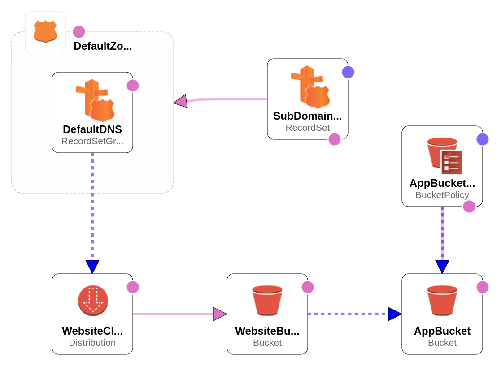

# README

## Set Up

### Pre-Requisites

-   Unix / Cygwin
-   Ruby
-   Ruby Gem: Bundler

### Install Dependencies

Run bundler to install the required Ruby Gems.

    bundle install

### Rake Tasks

#### Install

Runs various linters to verify the validity of the source code and generates the cloudformation template with lono.

    rake install

#### Deploy

Runs the install task and then attempts to deploy the cloudformation changes via the form_cloud.sh script.

    rake deploy

## Architecture

