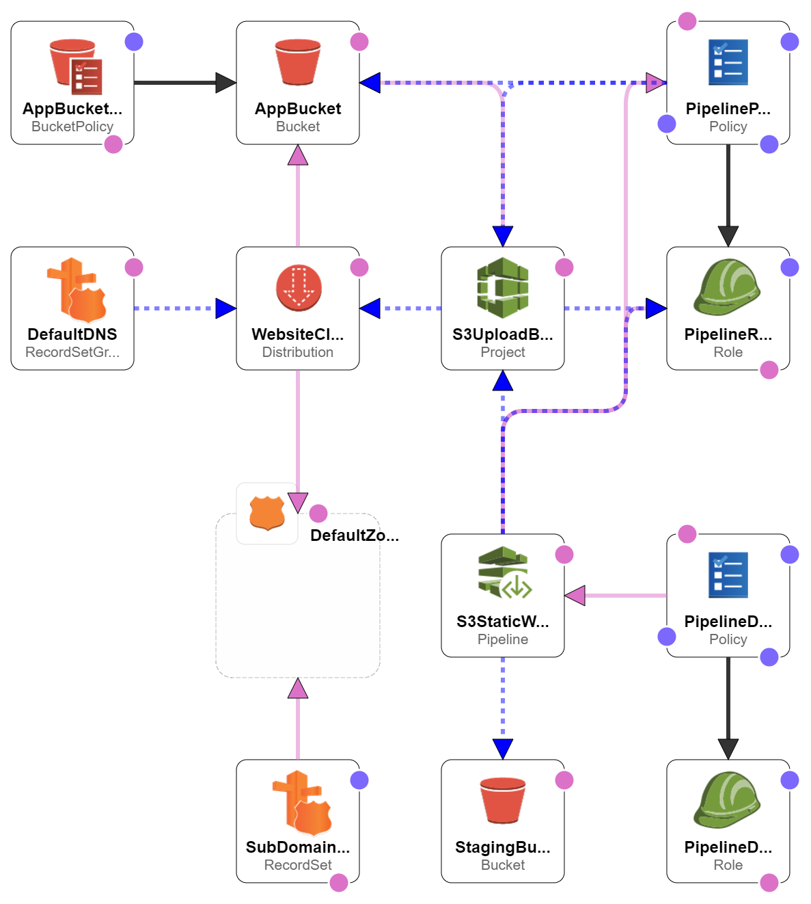

# README

## Set Up

### Pre-Requisites

- Unix / Cygwin
- Ruby
- Ruby Gem: Bundler

### Install Dependencies

Run bundler to install the required Ruby Gems.

```
bundle install
```

### Rake Tasks

#### Install

Runs various linters to verify the validity of the source code and generates the cloudformation template with lono.

```
rake install
```

### Deploying

Assuming your template file and parameter files have the same name, the script requires just 1 parameter, the name of the files but without the extension.

```
./form_cloud.sh development-sad-pipeline
```

## Architecture



## Workflow

Git Repo       | Branch  | Description
-------------- | ------- | ----------------------------------------------------------------------------------------------------------------------------------------------------------------------------------------------------------------------------------
AWS CodeCommit | develop | Upon pushing a commit to origin, the AWS CodePipeline will auto-magically trigger the deployment to the development environment.
AWS CodeCommit | master  | When a release is ready to be deployed to production, the developers should merge their code to the master branch. Deploying from master to production is a manual trigger, only avaiable for users with the appropriate IAM Role.

## Notes

- Creation of a sub domain can be toggled off by setting the RootDomain parameter to the exact same value as the ProjectName parameter.

## Naming Conventions

### Key

- ${ABC123} - Input parameter
- # {ABC123} - Hardcoded in the template, variable depending on which template.

### Roles

- Pipeline Assumed Role - ${ProjectName}-Role-#{EnvironmentTag}
- Pipeline User Deployment Role - ${ProjectName}-Role-#{EnvironmentTag}-deploy

### Policies

- Pipeline Assumed Policy - ${ProjectName}-Policy-#{EnvironmentTag}
- Pipeline User Deployment Policy - ${ProjectName}-Policy-#{EnvironmentTag}-deploy

### SubDomains

If you are using the template to create a sub domain of the ${RootDomain}, then the sub domain will match the format:

${EnvironmentTag}.${ProjectName}.${RootDomain}

## S3

- Static Website - www.#{EnvironmentTag}-${ProjectName}-${RootDomain}

## CodeStar

- Pipeline - ${ProjectName}-Pipeline-#{EnvironmentTag}
- Build - ${ProjectName}-Build-#{EnvironmentTag}

## TODO

- Outputs
- SSL Certificates
