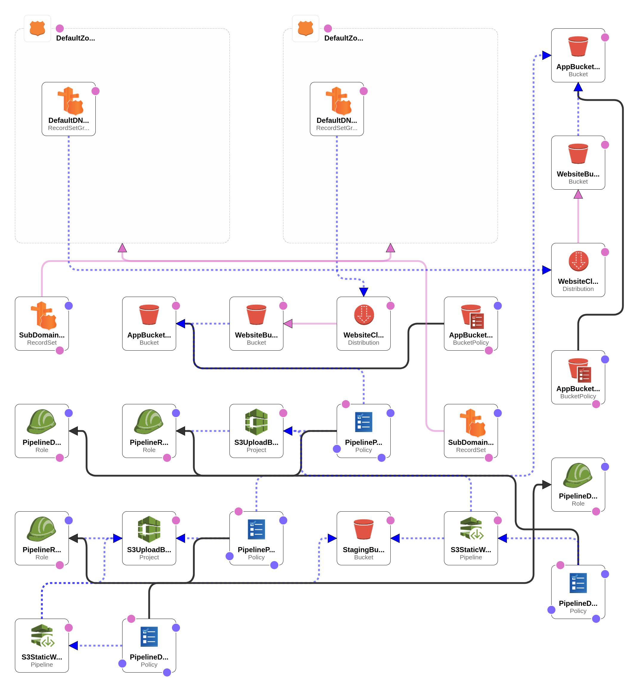

# README

## Set Up

### Pre-Requisites

-   Unix / Cygwin
-   Ruby
-   Ruby Gem: Bundler

### Install Dependencies

Run bundler to install the required Ruby Gems.

    bundle install

### Rake Tasks

#### Install

Runs various linters to verify the validity of the source code and generates the cloudformation template with lono.

    rake install

#### Deploy

Runs the install task and then attempts to deploy the cloudformation changes via the form_cloud.sh script.

    rake deploy

## Architecture

## Workflow

| Git Repo       | Branch  | Description |
|----------------|---------|-------------|
| AWS CodeCommit | develop | Upon pushing a commit to origin, the AWS CodePipeline will auto-magically trigger the deployment to the development environment. |
| AWS CodeCommit | master  | When a release is ready to be deployed to production, the developers should merge their code to the master branch.  Deploying from master to production is a manual trigger, only avaiable for users with the appropriate IAM Role. |

## TODO

-   CloudFront invalidation upon deployment.
-   IP Restrictions
-   Investigate federated logins
-   Toggle sub domains if no root domain exists (provide only default AWS urls).
